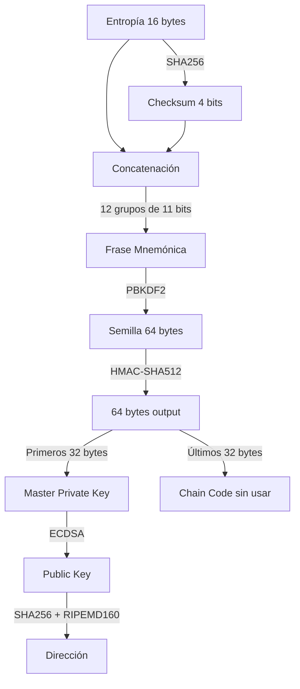
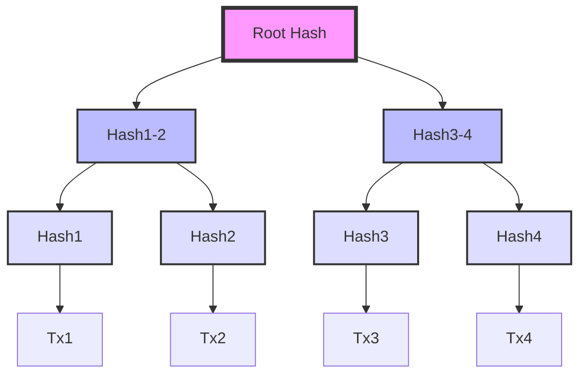
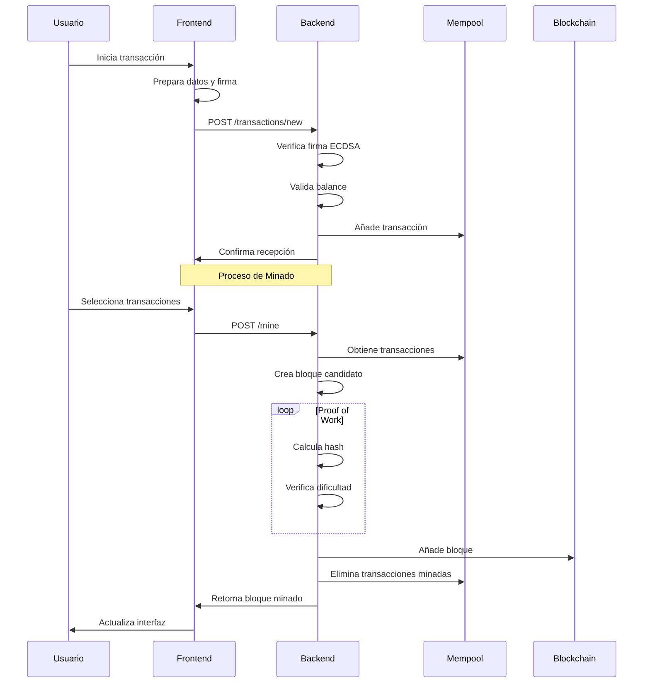
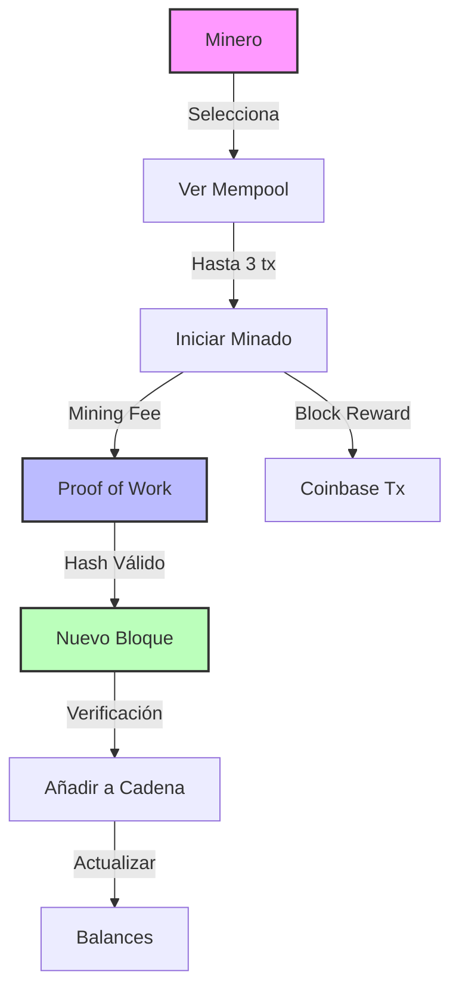
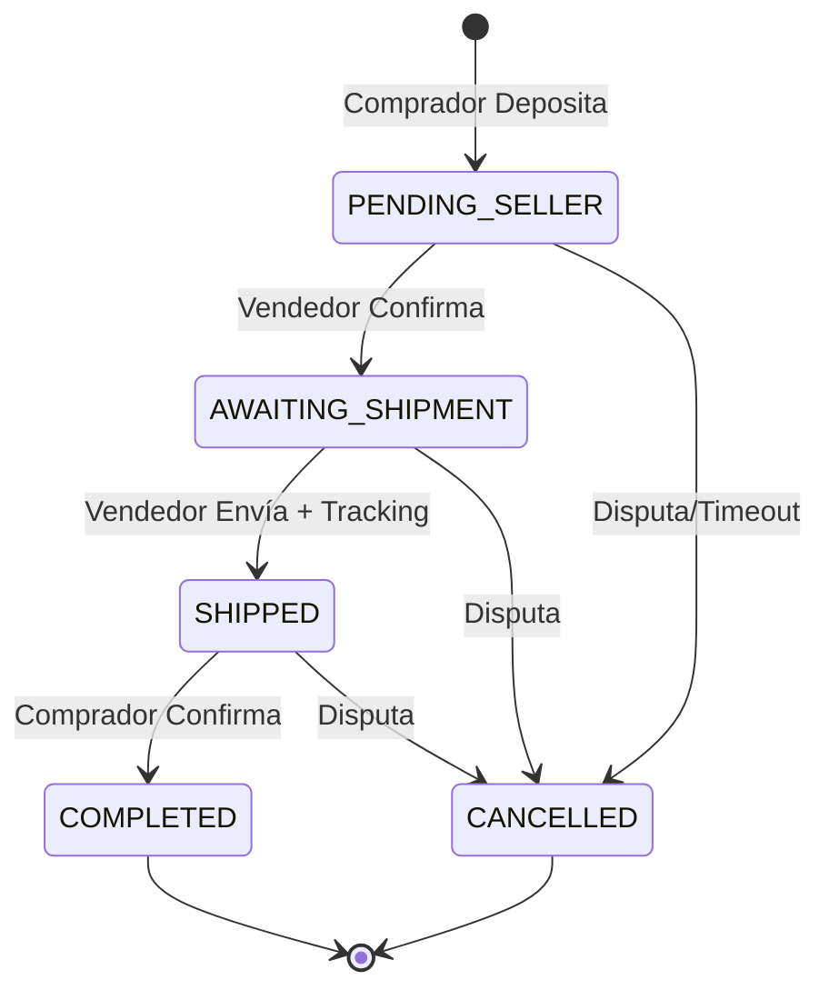
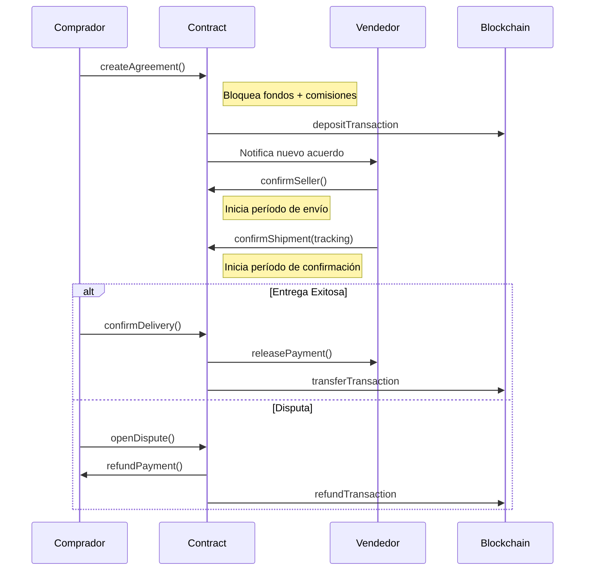
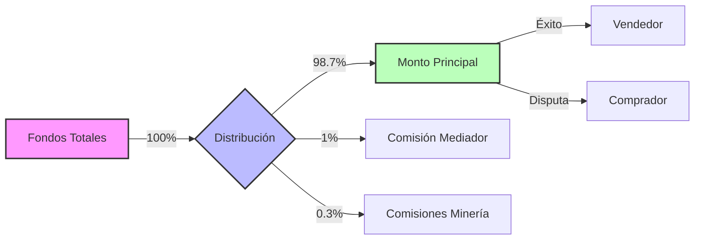

# 🔗 Análisis del Simulador Blockchain: Características, Algoritmos y Aplicaciones

## 📌 1. Introducción

El simulador blockchain implementado demuestra los conceptos fundamentales de la tecnología blockchain a través de una implementación educativa pero robusta. Esta documentación analiza sus características, algoritmos utilizados y potenciales extensiones.

## 🌟 2. Características Fundamentales de Blockchain Implementadas

### 🔄 2.1 Descentralización
El sistema implementa una cadena de bloques descentralizada donde:
- Cada bloque contiene múltiples transacciones
- La integridad se mantiene a través de hashes encadenados
- La verificación es distribuida y transparente

### 🔒 2.2 Inmutabilidad
Se garantiza mediante:
- Hashes SHA-256 para cada bloque
- Enlaces criptográficos entre bloques consecutivos
- Merkle trees para las transacciones
- Verificación completa de la cadena

### 👁️ 2.3 Transparencia
Todas las transacciones son:
- Públicamente verificables
- Permanentemente almacenadas
- Trazables a través de la cadena

## ⚙️ 3. Análisis de Componentes Principales

### 💼 3.1 Sistema de Carteras (Wallet System)

<details>
<summary>🔐 Proceso de Generación de Carteras</summary>



</details>

<details>
<summary>📝 Ejemplo Real de Generación</summary>

### 1️⃣ Entropía Inicial
Generamos 16 bytes de entropía aleatoria segura:
```
b9607f3e17a28b93fac8d225f029a21f
```

### 2️⃣ Proceso de Frase Mnemónica
1. Calculamos el checksum SHA256 de la entropía
2. Tomamos los primeros 4 bits del checksum: `0111`
3. Combinamos entropía + checksum
4. Dividimos en 12 grupos de 11 bits cada uno
5. Convertimos cada grupo en una palabra usando el diccionario BIP39

Resultado: 
```
rich advance sorry consider chunk six twelve bottom chalk life hammer discover
```

### 3️⃣ Generación de Semilla
1. Utilizamos PBKDF2 (Password-Based Key Derivation Function 2) 
   - Input: la frase mnemónica
   - Salt: "mnemonic" (sin passphrase adicional)
   - 2048 iteraciones
   - Resultado: semilla de 64 bytes

Semilla resultante:
```
eb7c262128ca9c2df68942449e526347e5fbac690ba31919cdd9309f3d822eac0e1b5da78caac8dc7464e22581265bb79f80507984246dc0184235c6595c94ba
```

### 4️⃣ Derivación de Clave Maestra
1. Aplicamos HMAC-SHA512
   - Input: la semilla
   - Key: "Bitcoin seed"
2. Del resultado de 64 bytes:
   - Primeros 32 bytes → Master Private Key:
     ```
     6f5dd801cee8b5fb32e8b53d415866d128fe78aa72cc554a6ead87175188989d
     ```
   - Últimos 32 bytes → Chain Code (no utilizado):
     ```
     aa2736bc6b3c4875a120a7e3388cce374ead3c7a9362c4d08cef99783cded8b4
     ```

### 5️⃣ Generación de Clave Pública
1. Utilizamos la curva elíptica secp256k1
2. Multiplicamos el punto generador por la clave privada
3. Obtenemos la clave pública sin comprimir (64 bytes):
```
57515390831c62952d73de0605260e9f11beaf2bd6429f2c2d13d960a79ca9e4cb1e4f9a737cbc0232a0803e0c0a1a81673d0b64e3200a3958a1945a9ae5de23
```

### 6️⃣ Creación de Dirección
1. Aplicamos SHA256 a la clave pública
2. Aplicamos RIPEMD160 al resultado
3. Obtenemos la dirección final:
```
f2025103a84d2ba893fd942a8140d09520958060
```

### 7️⃣ Protección de Clave Privada
1. Generamos un salt aleatorio de 16 bytes
2. Utilizamos la contraseña del usuario ("1234") con PBKDF2
3. Generamos un IV aleatorio
4. Ciframos la clave privada usando AES-256-CBC
5. Combinamos: salt + IV + datos cifrados
6. Codificamos en base64 para almacenamiento seguro

</details>

### 🌳 3.2 Merkle Tree en el Simulador

<details>
<summary>🔍 Implementación y Funcionamiento</summary>



#### 🔄 Proceso de Construcción
1. Se calcula el hash SHA256 de cada transacción individual
2. Los hashes se emparejan y se combinan
3. Proceso continúa hasta obtener un único hash (root)
4. Si hay número impar de hashes, se duplica el último

#### 🎯 Beneficios en el Simulador
- **Eficiencia**: Verificación rápida de transacciones
- **Integridad**: Detección inmediata de modificaciones
- **Pruebas de Inclusión**: Verificación sin descargar todo el bloque
- **Escalabilidad**: Estructura optimizada para grandes conjuntos de datos

</details>

### 3.3 🔄 Sistema de Transacciones y Minado

<details>
<summary><strong>📝 3.3.1 Flujo de Transacciones</strong></summary>

#### Diagrama de Secuencia
> Ilustra el proceso completo desde la creación hasta la confirmación de una transacción



#### Características Principales
- Verificación de firmas ECDSA
- Validación de balances
- Sistema de comisiones
- Confirmaciones en tiempo real
</details>

<details>
<summary><strong>⛏️ 3.3.2 Sistema de Minería</strong></summary>

#### Casos de Uso
> Proceso de minado y distribución de recompensas



#### Características
- Selección de hasta 3 transacciones
- Dificultad ajustable (0-4 ceros)
- Recompensa base + comisiones
- Verificación de bloques minados
</details>

### 3.4 📜 Smart Contract de Custodia (Escrow)

<details>
<summary><strong>🔄 3.4.1 Estados del Contrato</strong></summary>

#### Diagrama de Estados
> Estados y transiciones posibles del contrato



#### Características del Sistema
- Transiciones automáticas
- Validaciones por estado
- Timeouts configurables
- Sistema de disputas
</details>

<details>
<summary><strong>🤝 3.4.2 Operaciones del Contrato</strong></summary>

#### Diagrama de Secuencia
> Interacciones entre participantes



#### Operaciones Principales
- Creación de acuerdo
- Confirmación de vendedor
- Registro de envío
- Confirmación de recepción
- Gestión de disputas
</details>

<details>
<summary><strong>💰 3.4.3 Sistema de Comisiones</strong></summary>

#### Diagrama de Flujo Financiero
> Distribución de fondos y comisiones



#### Desglose de Comisiones
- Mediador: 1%
- Minería: 0.1% × 3
- Monto principal: 98.7%
</details>

## 💡 4. Aplicaciones Prácticas Detalladas

### 💰 4.1 Finanzas Descentralizadas (DeFi)
<details>
<summary>📊 Ver Aplicaciones DeFi</summary>

#### 🏦 4.1.1 Custodia de Activos
- **Sistema de Custodia Segura**
  - Contratos inteligentes verificables
  - Bloqueo temporal programable
  - Múltiples firmantes requeridos
  - Condiciones personalizables

- **Monitoreo en Tiempo Real**
  - Seguimiento de estado de fondos
  - Notificaciones de eventos
  - Auditoría completa de movimientos

#### 🔄 4.1.2 Intercambios Atómicos
- **Proceso Automatizado**
  1. Propuesta de intercambio
  2. Bloqueo de activos
  3. Verificación de condiciones
  4. Ejecución simultánea
  5. Confirmación bilateral

- **Características de Seguridad**
  - Sin custodia central
  - Cancelación automática
  - Tiempos límite configurables

#### 💳 4.1.3 Préstamos Colateralizados
- **Gestión de Préstamos**
  - Evaluación automática de garantías
  - Ratio de colateralización dinámico
  - Liquidación programada
  - Gestión de intereses

- **Características Avanzadas**
  - Multi-colateral
  - Préstamos flash
  - Refinanciación automática

#### 🏊 4.1.4 Pools de Liquidez
- **Funcionamiento**
  - Agregación de fondos
  - Market making automático
  - Distribución proporcional
  - Comisiones dinámicas

- **Innovaciones**
  - Pools concentrados
  - Múltiples niveles de riesgo
  - Incentivos para proveedores

</details>

### 📦 4.2 Supply Chain
<details>
<summary>🔍 Ver Aplicaciones en Supply Chain</summary>

#### 🔄 4.2.1 Trazabilidad
- **Seguimiento en Tiempo Real**
  - Registro de ubicación GPS
  - Condiciones ambientales
  - Tiempos de tránsito
  - Transferencias de custodia

- **Documentación Digital**
  - Certificados de origen
  - Permisos sanitarios
  - Documentos de aduana
  - Facturas comerciales

#### ✅ 4.2.2 Verificación de Autenticidad
- **Sistema de Verificación**
  - Identificadores únicos
  - Sellos digitales
  - Firmas criptográficas
  - Certificados de autenticidad

- **Prevención de Falsificaciones**
  - Marcadores físicos-digitales
  - Histórico inmutable
  - Validación multi-factor

#### 📊 4.2.3 Gestión de Inventario
- **Control Automatizado**
  - Actualización en tiempo real
  - Predicción de demanda
  - Optimización de stock
  - Alertas automáticas

- **Integración IoT**
  - Sensores RFID
  - Monitoreo ambiental
  - Control de calidad
  - Mantenimiento predictivo

#### 🏭 4.2.4 Casos de Uso Específicos
- **Farmacéutica**
  - Control de temperatura
  - Trazabilidad de lotes
  - Verificación de caducidad
  - Gestión de recalls

- **Alimentos**
  - Cadena de frío
  - Origen de productos
  - Certificaciones orgánicas
  - Información nutricional

- **Lujo**
  - Autenticación de productos
  - Historial de propiedad
  - Certificados digitales
  - Garantías verificables

</details>

### 🆔 4.3 Identidad Digital
<details>
<summary>👤 Ver Aplicaciones de Identidad</summary>

#### 📜 4.3.1 Credenciales Verificables
- **Participantes**
  - Emisores autorizados
  - Titulares de identidad
  - Verificadores confiables
  - Redes de confianza

- **Tipos de Credenciales**
  - Identidad básica
  - Títulos académicos
  - Certificaciones profesionales
  - Licencias y permisos

#### ⚡ 4.3.2 Sistema de Claims
- **Características**
  - Auto-soberanía
  - Verificabilidad
  - Privacidad selectiva
  - Revocabilidad

- **Aplicaciones**
  - KYC financiero (Know Your Customer)
      - Ejemplo: Un cliente demuestra que vive en un país autorizado sin compartir su dirección completa.
  - Acceso a servicios
      - Ejemplo: Usuarios se autentican para usar plataformas
  - Votación electrónica
  - Control de acceso
      - Ejemplo: Identificación para acceder a edificios, eventos o sistemas de manera segura y anónima.

#### 🔐 4.3.3 Verificación Zero-Knowledge
- **Casos de Uso**
  - Verificación de edad
  - Prueba de solvencia
  - Validación de credenciales
  - Autenticación anónima

- **Beneficios**
  - Privacidad mejorada
  - Cumplimiento regulatorio
  - Minimización de datos
  - Protección contra fraudes

</details>

## 🚀 5. Características Potenciales y Mejoras

### 🔒 5.1 Zero-Knowledge Proofs
- zk-SNARKs para privacidad
    - Transacciones privadas ocultando remitentes, destinatarios y montos.
- Transacciones confidenciales
    - Mecanismos para ocultar detalles de transacciones financieras sin comprometer su validez.
- Ring signatures

### 🤖 5.2 Inteligencia Artificial
- Detección de fraudes
- Optimización de comisiones
- Análisis de patrones

### 🔄 5.3 Otras Mejoras
- Multifirma (esquemas m-de-n)
    - Decisiones colectivas.
- Proof of Stake
- Smart Contracts avanzados
- Generación de claves privadas mediante derivación BIP32

## 📚 6. Referencias y Recursos

<details>
<summary>📖 Enlaces y Documentación</summary>

### 📑 Documentación Técnica
- [BIP39 Specification](https://github.com/bitcoin/bips/blob/master/bip-0039.mediawiki)
- [Secp256k1 Documentation](https://en.bitcoin.it/wiki/Secp256k1)

### 🛠️ Herramientas
- [BIP39 Tool](https://iancoleman.io/bip39/)
- [Blockchain Demo](https://andersbrownworth.com/blockchain/)

</details>

---
<div align="center">


</div>
